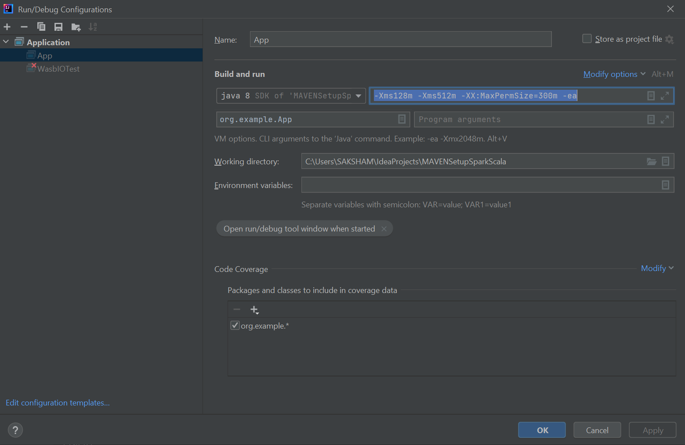

Resource used for Setup
https://learn.microsoft.com/en-us/azure/hdinsight/spark/apache-spark-create-standalone-application

Follow Steps under Paragraph
Create a standalone Scala project

Use POM as is

And Run run app configuration would be something like below.
VM Options : "-Xms128m -Xms512m -XX:MaxPermSize=300m -ea"

